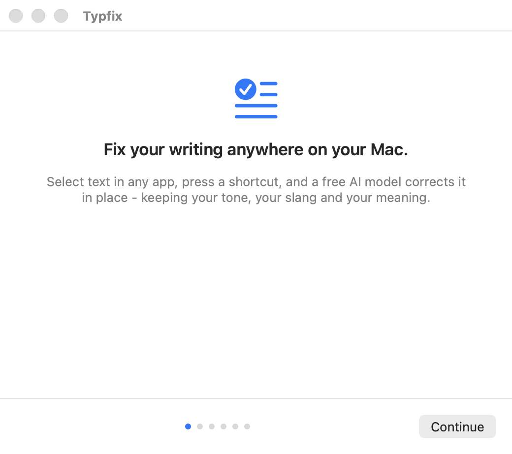
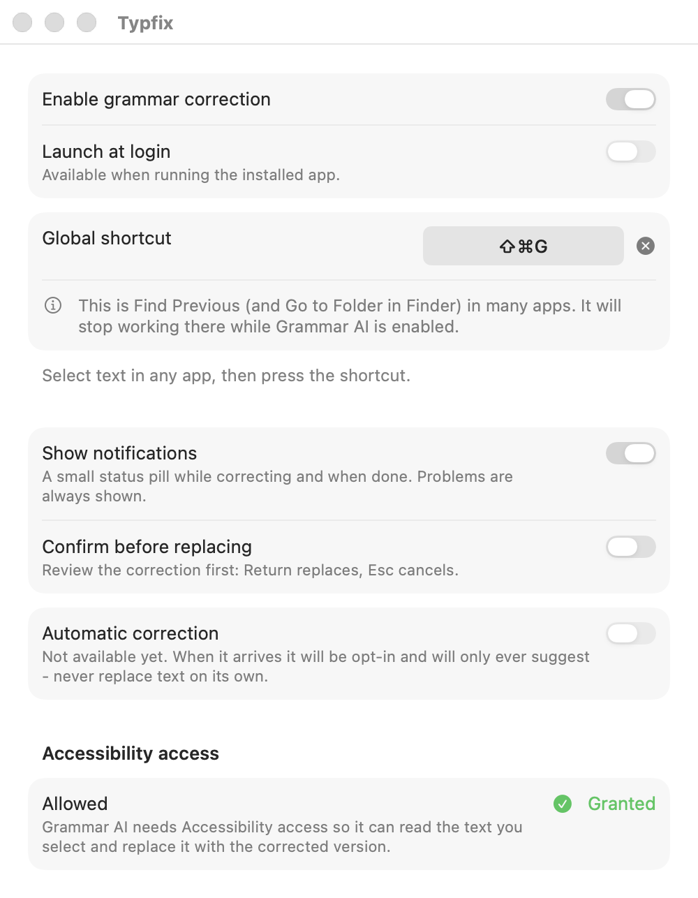
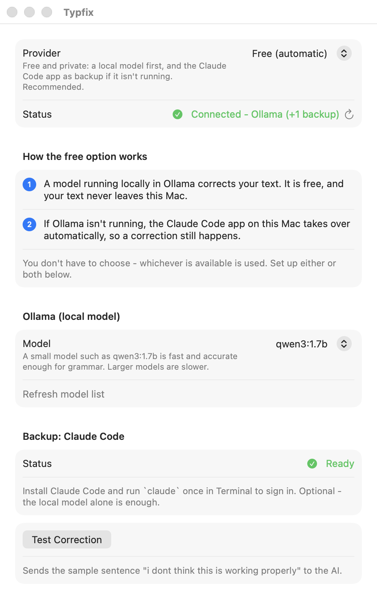

# Typfix

Fix your writing anywhere on your Mac.

Select text in any app, press **Cmd+Shift+G**, and Claude corrects the grammar,
spelling and punctuation in place - keeping your tone, your slang and your
meaning. It lives in the menu bar and stays out of the way.

```text
hey john, i wanted to ask if you can send me the files tommorow because i didnt recieved them yet
```

becomes

```text
Hey John, I wanted to ask if you can send me the files tomorrow because I didn't receive them yet.
```

and `hey bro can u send me that thing lol` stays casual:
`Hey bro, can u send me that thing? lol`

Typfix is a temporary working name. It is defined in one place
(`AppIdentity.swift` plus `Info.plist`) so it is easy to change.

## Features

- Works system-wide: Safari, Chrome, Arc, Slack, Discord, Messages, Mail,
  Notes, VS Code, Cursor, Notion, Word, Google Docs and ordinary text fields.
- One global shortcut (changeable), plus **right-click > Services > Correct
  with Typfix**, plus the menu bar icon.
- Fast: about 1.5 seconds per correction with the default setup.
- Four modes: Basic Grammar, Natural, Professional, and Custom (your own
  instruction).
- Preserves tone, slang, emojis, technical terms, line breaks and code.
- Any language, detected automatically. Tested with English, Hebrew and
  mixed-language text. Text is never translated.
- Safe by construction: your text is only replaced after Claude's reply was
  parsed and validated - including a check that the reply actually resembles
  what you wrote - and only if the same text is still selected in the same
  app. If anything is off, nothing changes and the correction is put on your
  clipboard instead.
- Undo with Cmd+Z, like any paste.
- Optional "confirm before replacing" review panel.
- Private: no history, no keystroke logging, no screen recording, no
  analytics. See [PRIVACY.md](PRIVACY.md).
- Native Swift, no third-party dependencies, idle CPU of zero.
- Free by default: corrects with a local model (Ollama), falling back to
  Claude Code automatically if it isn't running. No API key needed.
- A Cursor / VS Code extension for inline fixing in the editor.

## Screenshots





The images are generated from the real UI by
`GrammarAI --screenshots docs/screenshots`.

## Requirements

- macOS 14 (Sonoma) or later, Apple Silicon or Intel.
- One of:
  - [Claude Code](https://claude.com/claude-code) installed and signed in
    (uses your Claude subscription, no API key needed) - the default, or
  - an Anthropic API key.
- To build: the Xcode Command Line Tools (`xcode-select --install`). The full
  Xcode app is not required.

## Installation

There is no prebuilt download yet, so you build it yourself. It takes about a
minute.

```bash
git clone https://github.com/KaspiDoron/grammar-ai.git
cd grammar-ai
scripts/setup-signing.sh      # once - see "Why the signing step" below
scripts/bundle-app.sh --run   # builds, installs to /Applications, launches
```

Then follow the six onboarding steps. The only thing macOS will ask you for is
Accessibility access.

### Why the signing step

macOS ties the Accessibility permission to the app's code signature. Without a
stable signature the permission silently stops working every time you rebuild
(the switch in System Settings still looks on). `scripts/setup-signing.sh`
creates a free, local, self-signed identity called "Typfix Local Dev" so
the permission survives rebuilds. It asks for your login password once. You
can skip it; the app still works, you just re-grant access after each rebuild.

## Claude setup

Open **Settings > AI Provider**.

- **Claude Code (default).** Install Claude Code, run `claude` once in
  Terminal and sign in. Typfix finds it automatically and shows
  "Connected". Each correction runs a locked-down, single-shot
  `claude -p`: no tools, no MCP servers, no skills, no hooks, nothing saved to
  disk.
- **Anthropic API key.** Choose "Anthropic API key", paste a key from
  [console.anthropic.com](https://console.anthropic.com) and click Save. The
  key is stored only in the macOS Keychain and is never shown again.

**Model** defaults to Automatic, which picks the fastest model for the
provider. **Test Correction** sends one sample sentence and shows the result
and the time it took.

## Accessibility permission

Typfix needs Accessibility access so it can read the text you select and
replace it with the corrected version. That is the only permission it uses.

System Settings > Privacy & Security > Accessibility > switch on **Grammar
AI**. Onboarding and Settings both have a button that opens that pane and
update by themselves once access is granted.

If the switch is on but the app says it has no access (usually after a rebuild
with an ad-hoc signature), remove Typfix from the list with the minus
button and add it again, or run:

```bash
tccutil reset Accessibility com.kaspidoron.grammarai
```

## Keyboard shortcut

The default is **Cmd+Shift+G**. Change it in Settings > General: click the
shortcut, press the new combination. Esc cancels, Delete removes the shortcut.

A global shortcut takes the combination away from other apps while Typfix
is enabled. Cmd+Shift+G is "Find Previous" in many apps and "Go to Folder" in
Finder, so Settings tells you about that. Pick another combination if you use
those, or use **Pause for 1 Hour** in the menu.

## In Cursor and VS Code (best experience)

For editors, there is a companion extension that fixes grammar **right in the
editor** with native undo, instead of via copy and paste - and, optionally,
underlines issues as you type with a one-click Quick Fix. It uses the same
free local model.

```bash
cd editor-extension && npm install && npm run package
cursor --install-extension grammar-ai.vsix   # or: code --install-extension ...
```

Then select text and press Cmd+Shift+G inside the editor. See
[editor-extension/README.md](editor-extension/README.md).

## Right-click menu

Select text, right-click, **Services > Correct with Typfix**. macOS has no
API for adding items to other apps' context menus; Services is the native
mechanism. It works in apps built on Apple's text system (Notes, Mail,
TextEdit, Safari text fields, Messages, Xcode). Chrome and Electron apps do not
accept text returned by a Service - use the shortcut there. If the item is
missing, enable it in System Settings > Keyboard > Keyboard Shortcuts >
Services > Text.

## Privacy

Only the text you select is sent to Claude, and only when you ask. Nothing is
stored. Full details: [PRIVACY.md](PRIVACY.md).

## Known limitations

- Terminals (Terminal, iTerm2, Warp, kitty, WezTerm, Alacritty, Ghostty): the
  correction is copied to the clipboard instead of pasted, because a selection
  there is not editable text.
- In apps that do not expose their text to Accessibility (Chrome, Electron
  apps, Google Docs) the clipboard is used briefly to copy the selection and
  paste the correction. Your clipboard is restored right after.
- Sublime Text, JetBrains IDEs, Zed and Nova copy the whole current line when
  nothing is selected, which cannot be told apart from a real one-line
  selection. For a single full line in those editors the correction is copied
  to the clipboard instead of pasted. (VS Code and Cursor mark that case, so
  they work normally.)
- A rewrite that drifts far from your original (possible in Professional and
  Custom modes) is never pasted on trust: the review panel opens first.
- Password fields are never read.
- Selections over 10,000 characters are refused.
- The app cannot be sandboxed or shipped through the Mac App Store, because
  the sandbox forbids controlling other apps through Accessibility.
- Automatic (as-you-type) correction is designed but not built. See
  [docs/ARCHITECTURE.md](docs/ARCHITECTURE.md).

## Development

```bash
swift build                    # debug build
scripts/test.sh                # 149 offline unit tests, about a second
scripts/test.sh --live         # also 9 tests against your real Claude setup
scripts/bundle-app.sh          # build/Typfix.app
scripts/bundle-app.sh --run    # build, install, relaunch
```

Tests use Swift Testing, which works with the Command Line Tools alone.
`scripts/test.sh` adds the framework search path that a machine without Xcode
needs. With Xcode installed you can also open `Package.swift` directly.

Logs (event names and error codes only, never your text):

```bash
/usr/bin/log stream --predicate 'subsystem == "com.kaspidoron.grammarai"' --info
```

### Troubleshooting

- "Claude Code not found": install it, or set its path in Settings > AI
  Provider.
- "Claude Code isn't signed in": run `claude` in Terminal and log in.
- Nothing happens on the shortcut: check the menu bar icon is not dimmed
  (off or paused) and that Accessibility access is granted.
- "Select some text first." in an app where text is selected: that app blocks
  both Accessibility and synthetic copy. Use right-click > Services, or copy
  the text into another app.

## Architecture

Three SwiftPM targets: `GrammarAICore` (pure logic, fully unit-tested),
`GrammarAISystem` (Accessibility, clipboard, synthesized keys, global hotkey)
and `GrammarAI` (the AppKit and SwiftUI app). The AI engine sits behind the
`AITextCorrectionProvider` protocol, so adding another provider is one new
type.

- [docs/ARCHITECTURE.md](docs/ARCHITECTURE.md) - modules, interfaces, security
  model.
- [docs/RESEARCH.md](docs/RESEARCH.md) - the experiments behind each platform
  decision.
- [docs/MANUAL_TESTING.md](docs/MANUAL_TESTING.md) - per-app test procedures.

## Contributing

Issues and pull requests are welcome. See [CONTRIBUTING.md](CONTRIBUTING.md).
Security reports: [SECURITY.md](SECURITY.md).

## License

[MIT](LICENSE). Typfix is an independent project and is not affiliated
with or endorsed by Anthropic. Claude is a trademark of Anthropic.
